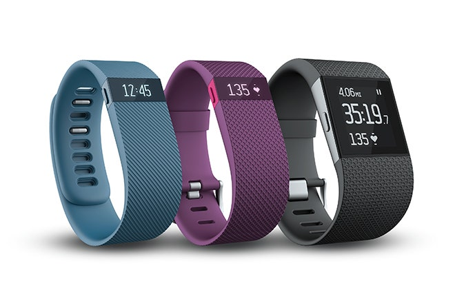

```{r setup, include=FALSE}
knitr::opts_chunk$set(echo = TRUE)
```

## Introduction

<center>

</center>

<center>
Image Source: [Bellabeat Facebook Page](https://www.facebook.com/bellabeat/photos/a.1414210192155247/2749506195292300/)
</center>

$~$

[Bellabeat](https://bellabeat.com/) is a tech-driven wellness company founded in 2013 by Sandro Mur and Urška Sršen that specializes in health-focused smart products for women and offer a line of products that help empower users with knowledge about their own health and habits. These products include:

- **Bellabeat App:** Provides users with a hub to track their health data related to their habits and activities.

- **Leaf:** Wellness tracker that can be worn as a bracelet, necklace, or clip that tracks activity, sleep, and stress. Connects to the Bellabeat app to provide the user insights into their daily wellness.

- **Time:** A watch that tracks user activity, sleep, and stress. Connects to the Bellabeat app to provide the user insights into their daily wellness.

- **Spring:** A water bottle that tracks daily water intake. Connects to the Bellabeat app to provide the user insights into their daily wellness.

- **Membership:** Gives users 24/7 access to fully personalized guidance based on their lifestyle and goals.

$~$

## Objective

Using data gathered from non-Bellabeat smart devices, we will perform exploratory data analysis to try to identify trends in smart device usage. Some questions that we will attempt to answer include:

1. What are some trends in smart device usage?
2. How could these trends apply to Bellabeat customers?
3. How could these trends help influence Bellabeat marketing strategy?

$~$

## The Data

<center>

</center>
[Image Source](https://images.app.goo.gl/P7UzfzD7pxtmUiBf9)

$~$

The data used in this analysis is from [Kaggle](https://www.kaggle.com/arashnic/fitbit) and was made available by the user [Möbius](https://www.kaggle.com/arashnic) (CC0: Public Domain). These datasets were generated by respondents to a distributed survey via Amazon Mechanical Turk. 30 eligible Fitbit users consented to the submission of personal tracker data, including minute-level output for physical activity, heart rate, and sleep monitoring.

Upon initial examination of the datasets in Excel, we immediately notice a few things:

- Data was collected between 3/12/2016 and 5/12/2016. 
- Datasets have differing levels of granularity, with some datasets containing minute-to-minute data and others containing daily data. 
- Several of the datasets are available in both long and wide formats
- There does not appear to be any data regarding water intake.

We will keep these observations in mind as we delve deeper into the data.

$~$

## Loading the Data

Let's start by load the necessary libraries:
```{r message=FALSE, warning=FALSE}
library(tidyverse)
library(lubridate)
library(ggcorrplot)
```

We will elect to use the datasets containing the daily data only.

Importing the datasets:
```{r}
daily_activity <- read_csv("dailyActivity_merged.csv")
daily_sleep <- read_csv("sleepDay_merged.csv")
weight_log <- read_csv("weightLogInfo_merged.csv")
```

$~$

Next, we'll quickly examine the structure of each of the three tables using head() and glimpse():

### Activity Dataset
```{r}
head(daily_activity)
glimpse(daily_activity)
```


### Sleep Dataset
```{r}
head(daily_sleep)
glimpse(daily_sleep)
```


### Weight Dataset
```{r}
head(weight_log)
glimpse(weight_log)
```

We can see that the in the Activity Dataset, the "ActivityDate" column have a data type of character. Similarly, the date column in both the sleep and weight datasets also have a data type of character. We will need to convert these columns to a data type of date. Furthermore, in the sleep and weight datasets we see that the date columns have both the date as well as the time so we will need to clean that up as well.

$~$

## Cleaning the Data

### Dropping unnecessary columns

To start off, we will remove columns that are redundant or unnecessary.

In the daily_activity dataset, the columns "TrackerDistance" and "LoggedActivityDistance" are not needed since we already have a "TotalDistance" column which is the sum of the previous 2 columns mentioned. We'll go ahead and remove those 2 columns.
```{r}
daily_activity_clean <- 
    daily_activity %>% 
    select(-TrackerDistance,
           -LoggedActivitiesDistance)

head(daily_activity_clean)
```


In the daily_sleep dataset, we can remove the "TotalSleepRecords" column as it is irrelevant for this analysis.
```{r}
daily_sleep_clean <- 
    daily_sleep %>% 
    select(-TotalSleepRecords)

head(daily_activity_clean)
```


In the weight_log dataset, we can remove the "Fat" (only has 2 records, the rest are all NA), "WeightKg" (we don't need 2 weight columns), "IsManualReport", and "LogId" columns as they are unnecessary.
```{r}
weight_log_clean <- 
    weight_log %>% 
    select(-Fat,
           -WeightKg,
           -IsManualReport,
           -LogId)

head(weight_log_clean)
```

$~$

### Removing Duplicate Rows

We'll now check for duplicate rows in each dataset:
```{r}
daily_activity_clean <- 
    daily_activity_clean %>% 
    distinct()

daily_sleep_clean <- 
    daily_sleep_clean %>% 
    distinct()

weight_log_clean <- 
    weight_log_clean %>% 
    distinct()
```


```{r}
# Uncleaned dataset had 940 rows and 15 columns
nrow(daily_activity_clean)

# Uncleaned dataset had 413 rows and 55 columns
nrow(daily_sleep_clean)

# Uncleaned dataset had 67 rows and 8 columns
nrow(weight_log_clean)
```

From the above we see that the "daily_sleep" dataset had 3 duplicate rows removed while the other 2 datasets were unmodified.

$~$

### Formatting the Date Columns

As mentioned earlier, the date type of the date column in all 3 tables were formatted as character data type. We will convert it into a date data type.
```{r}
daily_activity_clean$ActivityDate <- mdy(daily_activity_clean$ActivityDate)

daily_activity_clean <- 
    daily_activity_clean %>% 
        rename(Date = ActivityDate)

head(daily_activity_clean)
```


```{r warning=FALSE}
# Separate the date column into 2 rows, then drop the Time column
daily_sleep_clean <- 
    daily_sleep_clean %>% 
    separate(SleepDay, c("Date", "Time"), sep=" ") %>% 
    select(-Time)

# Convert Date column to mdy format
daily_sleep_clean$Date <- mdy(daily_sleep_clean$Date)
    

head(daily_sleep_clean)
```


```{r warning=FALSE}
# Separate the date column into 2 rows, then drop the Time column
weight_log_clean <- 
    weight_log_clean %>% 
    separate(Date, c("Date", "Time"), sep=" ") %>% 
    select(-Time)

# Convert Date column to mdy format
weight_log_clean$Date <- mdy(weight_log_clean$Date)
    

head(weight_log_clean)
```

From the output above, all of the date columns were successfully formatted from character to date.

$~$

### Summarizing the Data/Checking for NA's

We will use summary() to get descriptive statistics to check for any obvious issues for each variable. Summary() also comes with the added benefit of providing us with the count of the NA's for each column, if any.
```{r}
daily_activity_clean %>% 
    select(-Id,
           -Date) %>% 
    summary()
```


```{r}
daily_sleep %>% 
    select(TotalMinutesAsleep, 
           TotalTimeInBed) %>% 
    summary()
```


```{r}
weight_log_clean %>% 
    select(-Id,
           -Date) %>% 
    summary()
```

Based on the output, there does appear to be some high values, for example an individual logged 4900 calories burned. However, this does appear to be within reason. The summary output also states that there are no NA's in any of out variables so we are good from that regard. 

We can now merge the three datasets.

$~$

### Merging the Datasets

For each of the three datasets, we notice that the ID and Date fields are present so we can join the tables on these columns.

Let's first check the number of unique IDs for each dataset:
```{r}
n_distinct(daily_activity$Id)
n_distinct(daily_sleep$Id)
n_distinct(weight_log$Id)
```

From this we see that 33 individuals logged data for activity while only 24 and 8 users logged data for sleep and weight, respectively. In this case we'll use 2 left joins to join the 3 datasets on the "Id" and "Date" columns so we don't lose any data.
```{r}
combined_data <- left_join(left_join(daily_activity_clean, 
                                     daily_sleep_clean, 
                                     by=c("Id", "Date")), weight_log_clean, by=c("Id", "Date"))
```


```{r}
glimpse(combined_data)
```

Everything looks good so far and we can proceed with our exploratory data analysis!

$~$

## Exploratory Data Analysis

### Correlation Matrices

To begin, we will create some correlation matrices to get a general idea of what relationships exist between our variables. 

Please note that I omitted the variables related to distance due to redundancy with the "Minutes" variables as well as improving the viewability of the visualization.
```{r}
combined_data %>% 
    filter(!is.na(TotalMinutesAsleep)) %>% # Filtering out the data that do not have any sleep logged
    select(-Id, -Date, -WeightPounds, -BMI, -ends_with("Distance")) %>% 
    cor() %>% 
    round(2) %>% 
    ggcorrplot(hc.order = TRUE, 
               ggtheme = ggplot2::theme_gray,
               colors = c("#6D9EC1", "white", "#E46726"),
               lab=TRUE)
    
```

Now this is a lot of information so we will focus on the relationships that have a r-value of > 0.5 or < -0.5. 

We do see some moderately strong to strong positive correlations with the following:

- Total Steps vs Very Active Minutes (r = 0.54)
- Calories vs Very Active Minutes (r = 0.61)
- Fairly Active Minutes vs Total Steps (r = 0.57)
- Total Time in Bed vs Total Minutes Asleep (r = 0.93)

These relationships intuitively all make sense as more activity results in more more calories burned and more steps taken. The relationship between total time in bed and time asleep is also obvious.

We also see some moderately strong negative correlations with the following:

- Total Time in Bed vs Sedentary Minutes (r = -0.62)
- Total Time Asleep vs Sedentary Minutes (r = -0.6)

This suggests that as the amount of sleep increases, the amount of minutes of being sedentary decreases.

$~$

We will also create a similar correlation matrix that includes the variables associated to weight. We are doing this because there are only 35 rows of data that include both sleep and weight information logged which may result in unreliable findings due to a small sample size. Nonetheless, let's create the correlation matrix and see if any relationships exist between weight and the other variables. I have excluded BMI from the matrix due to the redundancy with weight.
```{r}
#Subsetting the data for the correlation matrix
combined_data %>% 
    filter(!is.na(WeightPounds) & !is.na(TotalMinutesAsleep)) %>% # Filtering out the data that do not have any weight nor sleep logged
    select(-Id, -Date, -BMI, -ends_with("Distance")) %>%
    glimpse()

```


```{r}
    combined_data %>% 
    filter(!is.na(WeightPounds) & !is.na(TotalMinutesAsleep)) %>% # Filtering out the data that do not have any weight nor sleep logged
    select(-Id, -Date, -BMI, -ends_with("Distance")) %>%
    cor() %>% 
    round(1) %>% 
    ggcorrplot(hc.order = TRUE, 
               ggtheme = ggplot2::theme_gray,
               colors = c("#6D9EC1", "white", "#E46726"),
               lab=TRUE)
```

Focusing only on the correlations related to weight, we can see that the only moderately strong relationship is a negative relationship between weight and minutes doing light activity.

$~$

### Trends in Activity

Next, let's see if there is any relationship between day of the week and activity intensity for the participants.

Creating a column for day of the week and setting it as a factor:
```{r}
combined_data$DayOfWeek <- 
    weekdays(combined_data$Date) %>%
        factor(levels = c("Sunday", "Monday", "Tuesday", "Wednesday",
                          "Thursday", "Friday", "Saturday"))
```


Creating a new dataframe, "activity_df", based on the aggregated minutes active based on intensity and grouped by date. We will also need to convert this dataframe into a long format in order to create the visualization.
```{r}
combined_data %>% 
    group_by(DayOfWeek) %>% 
    summarize(VeryActive = round(mean(VeryActiveMinutes), 2),
              FairlyActive = round(mean(FairlyActiveMinutes), 2),
              LightlyActive = round(mean(LightlyActiveMinutes), 2),
              Sedentary = round(mean(SedentaryMinutes), 2)) %>% 
    pivot_longer(!DayOfWeek, names_to = "Intensity", values_to = "Minutes") -> activity_df
```


Setting intensity level as a factor:
```{r}
activity_df$Intensity <- 
    activity_df$Intensity %>% 
        factor(levels = c("VeryActive", "FairlyActive", "LightlyActive", "Sedentary"))

head(activity_df)
```


Creating the visualization:
```{r}
activity_df %>% 
    ggplot(aes(x=DayOfWeek, y=Minutes, fill=Intensity)) + 
    geom_col(color='azure2', alpha=0.7, position="dodge") + 
    scale_fill_brewer(palette = "PuOr") +
    theme_minimal() +
    labs(title = "Average Active Minutes by Intensity and Day",
         x = "Day of the Week",
         y= "Minutes Active",
         fill = "Intensity Level")
```

We obverse that the bulk of the activity minutes were spent being sedentary and there does not seem to be any specific pattern day by day.


Let's also take a look at the visualization without the sedentary intensity level:
```{r}
activity_df %>% 
    filter(Intensity != "Sedentary") %>% 
    ggplot(aes(x=DayOfWeek, y=Minutes, fill=Intensity)) + 
    geom_col(color='azure2', position="dodge") + 
    scale_fill_brewer(palette = "Accent") +
    theme_minimal() +
    labs(title = "Average Active Minutes by Intensity and Day",
         x = "Day of the Week",
         y= "Minutes Active",
         fill = "Intensity Level")
```

We see that minutes of light intensity activity doesn't really have a particular pattern either.


Lastly, let's remove lightly active intensity and focus on just the very active and fairly active intensities:
```{r}
activity_df %>% 
    filter(!Intensity %in% c("LightlyActive", "Sedentary")) %>% 
    ggplot(aes(x=DayOfWeek, y=Minutes, fill=Intensity)) + 
    geom_col(color='azure2') + 
    geom_text(aes(label = Minutes), vjust = 1.5) +
    stat_summary(fun = sum, aes(label = ..y.., group = DayOfWeek), geom = "text", vjust= -.35) +
    scale_fill_brewer(palette = "Spectral") +
    theme_minimal() +
    labs(title = "Average Active Minutes by Intensity and Day",
         x = "Day of the Week",
         y= "Minutes Active",
         fill = "Intensity Level")
```

According to Mayo Clinic, most healthy adults should aim for at least 30 minutes of moderate activity a day^[Edward R. Laskowski, M. D. (2019, April 27). How much exercise do you really need? Mayo Clinic. https://www.mayoclinic.org/healthy-lifestyle/fitness/expert-answers/exercise/faq-20057916.]. This graph shows that on average these individuals are indeed hitting those 30 minutes of moderate activity per day (assuming fairly active intensity equates to at least moderate activity by Mayo Clinic's definition).

$~$

### Trends in Sleep
```{r}
combined_data %>% 
    filter(!is.na(TotalMinutesAsleep)) %>% 
    ggplot(aes(x=TotalMinutesAsleep)) +
    geom_histogram(binwidth= 25, fill='darkturquoise', color="azure1") +
    theme_light() +
    labs(title = "Distriubtion of Minutes Slept",
         x = "Minutes Asleep",
         y = "Count") +
    geom_vline(aes(xintercept=median(TotalMinutesAsleep)), color="black", linetype="dashed") +
    annotate("text", x=370, y=53, label="Median = 433")
```

The distribution of logged sleep roughly follows a normal distribution. The median amount of sleep logged for a given day is **7 hours and 13 minutes**. According to the Sleep Foundation, adults between 18 and 64 are recommended to get 7 to 9 hours of sleep per day^[Sleep Statistics - Facts and Data About Sleep 2020 | Sleep Foundation. (2021). Retrieved from https://www.sleepfoundation.org/how-sleep-works/sleep-facts-statistics].

Let's also take a look at average sleep duration at different days of the week:
```{r}
combined_data %>% 
    filter(!is.na(TotalMinutesAsleep)) %>% 
    group_by(DayOfWeek) %>% 
    summarize(AvgSleep = mean(TotalMinutesAsleep)) %>% 
    ggplot(aes(x=DayOfWeek, y=AvgSleep, fill=DayOfWeek)) +
    geom_col(color = "azure1", alpha=0.8) +
    geom_text(aes(label = round(AvgSleep,2)), vjust = 1.5) +
    scale_fill_brewer(palette = "Accent") +
    theme_minimal() + 
        labs(title = "Average Sleep by Day",
         x = "Day of Week",
         y = "Average Sleep Duration (min)") +
    theme(legend.position='none')
```

It appears that average sleep duration is below the recommended 7 hours for 5 out of the 7 days (Monday, Tuesday, Thursday, Friday, Saturday).

$~$

One last thing we can look into is **sleep latency**, that is the time it takes for you to fall asleep. According to Healthline, it typically takes 10 to 20 for an individual to fall asleep - a sleep latency outside of that range may indicate an underlying sleep condition^[Silver, N. (2020, June 5). How long does it take to fall asleep? Average time and tips. Healthline. https://www.healthline.com/health/healthy-sleep/how-long-does-it-take-to-fall-asleep#normal-sleep.].

We will make the assumption that the variable "TotalTimeInBed" only includes the time sleeping and the time attempting to sleep. Let's go ahead and calculate the average and median sleep latency and plot the distribution:
```{r}
combined_data %>% 
    filter(!is.na(TotalMinutesAsleep)) %>%
    summarize(AverageSleepLatency = mean(TotalTimeInBed - TotalMinutesAsleep),
              MedianSleepLatency = median(TotalTimeInBed - TotalMinutesAsleep))
    
```


```{r}
combined_data %>% 
    filter(!is.na(TotalMinutesAsleep)) %>%
    mutate(SleepLatency = TotalTimeInBed - TotalMinutesAsleep) %>% 
    ggplot(aes(x=SleepLatency)) +
    geom_histogram(binwidth= 8, fill='coral1', color="azure1") +
    theme_light() +
    labs(title = "Distriubtion of Sleep Latency",
         x = "Sleep Latency (mins)",
         y = "Count") +
    geom_vline(aes(xintercept=median(SleepLatency)), color="black", linetype="dashed") +
    annotate("text", x=60, y=92, label="Median = 25.5")
```

The distribution of sleep is skewed right as the bulk of the observations are on the lower end with a few large outliers, which could indicate insomnia. This is also underlined by the fact that the median sleep latency is less than the mean sleep latency (39.3 vs 25.5). We note that even the median sleep latency is above the recommended sleep latency range of 10 to 20 minutes.

$~$

Since it seems like the average sleep latency is on the higher side it may be possible that sleep latency has an effect on minutes of activity. Let's plot it vs the 4 different intensities to confirm.
```{r}
combined_data %>% 
    filter(!is.na(TotalMinutesAsleep)) %>%
    mutate(SleepLatency = TotalTimeInBed - TotalMinutesAsleep) %>% 
    ggplot(aes(x=SleepLatency, y=SedentaryMinutes)) +
    geom_point() +
    theme_light() +
    labs(title = "Sedentary Minutes vs Sleep Latency",
         x = "Sleep Latency (mins)",
         y = "Time Spent Sedentary (mins)") +
    annotate("text", x=275, y=1125, label="r = -0.17")
```


```{r}
combined_data %>% 
    filter(!is.na(TotalMinutesAsleep)) %>%
    mutate(SleepLatency = TotalTimeInBed - TotalMinutesAsleep) %>% 
    ggplot(aes(x=SleepLatency, y=LightlyActiveMinutes)) +
    geom_point() +
    theme_light() +
    labs(title = "Lightly Active Minutes vs Sleep Latency",
         x = "Sleep Latency (mins)",
         y = "Lightly Active Minutes") +
    annotate("text", x=275, y=425, label="r = -0.15")
```


```{r}
combined_data %>% 
    filter(!is.na(TotalMinutesAsleep)) %>%
    mutate(SleepLatency = TotalTimeInBed - TotalMinutesAsleep) %>% 
    ggplot(aes(x=SleepLatency, y=FairlyActiveMinutes)) +
    geom_point() +
    theme_light() +
    labs(title = "Fairly Active Minutes vs Sleep Latency",
         x = "Sleep Latency (mins)",
         y = "Fairly Active Minutes") +
    annotate("text", x=275, y=137, label="r = 0.32")
```


```{r}
combined_data %>% 
    filter(!is.na(TotalMinutesAsleep)) %>%
    mutate(SleepLatency = TotalTimeInBed - TotalMinutesAsleep) %>% 
    ggplot(aes(x=SleepLatency, y=VeryActiveMinutes)) +
    geom_point() +
    theme_light() +
    labs(title = "Very Active Minutes vs Sleep Latency",
         x = "Sleep Latency (mins)",
         y = "Very Active Minutes") +
    annotate("text", x=275, y=175, label="r = 0.08")
```

We notice that there is only a weak positive correlation between fairly active minutes and sleep latency while for the other intensities there is no relationship with sleep latency.

$~$

## Conclusion and Parting Thoughts


[Image Source](https://images.app.goo.gl/CDVpyP477zVsAdPv7)

$~$

**Findings:**

- There were a fair number of individuals that were getting too much sleep, too little sleep, or had a high sleep latency. Bellabeat could look into providing users recommendations when any of their sleeping patterns fall out of the optimal range.
- Logging was inconsistent especially with recording weight. Bellabeat should look into ways to make logging more consistent, possibly sending a notification to reminding users via the Bellabeat app. With weight in particular, potentially a smart scale could help users record weight by automatically updating their weight in the app when they use the scale.

**Suggestions for Further Investigation:**

There are definitely several things we can improve with regards to the data if we want to do any follow up analyses:

- Survey more individuals over a longer period of time.
- For any data that needs manual logging, make sure individuals are consistently logging them.
- Collect some basic demographic information with regards to the participants to ensure we have a representative sample.
- Since we did not have any water intake data it would definitely be helpful to obtain this, if available.

$~$

Thanks for reading! The files, data, and images for this case study can be found on [GitHub](https://github.com/bxwu/bellabeatcasestudy).